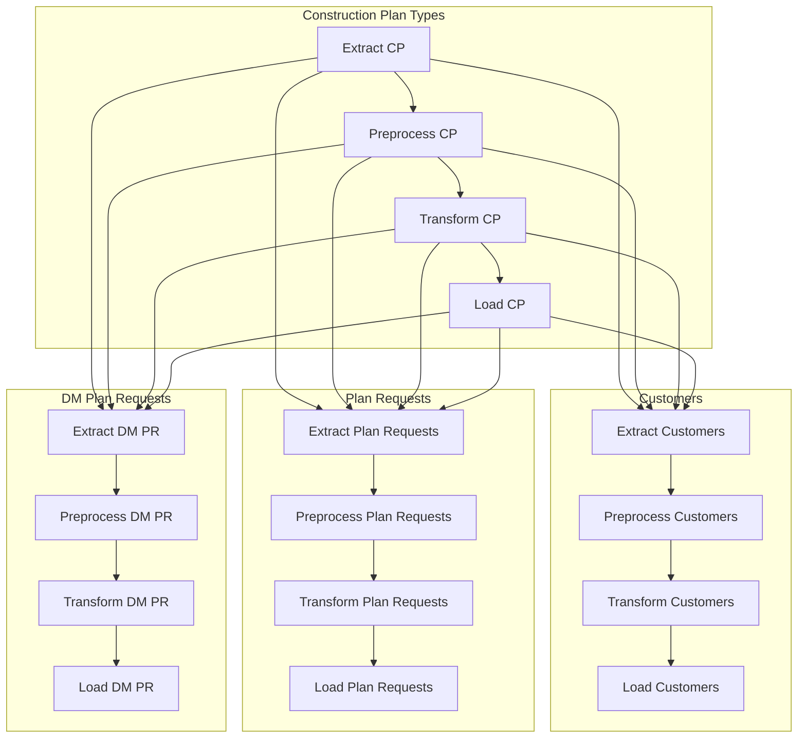

# Multi-Table ETL Pipeline DAG (`multi_table_etl_pipeline`)

## Overview
This DAG orchestrates the Extract‑Preprocess‑Transform‑Load (ETL) steps for four interrelated tables:
- `construction_plan_types` (base table, no upstream dependencies)
- `customers`
- `plan_requests`
- `dm_plan_requests`

Each table follows the same internal task pattern, implemented via a factory function that creates a `TaskGroup` containing four `PythonOperator` tasks:
1. **extract** – pulls raw data (CSV → staging Parquet)  
2. **preprocess** – cleans/normalises the extracted data  
3. **transform** – applies business‑logic transformations  
4. **load** – writes the final dataset to the data warehouse  

The DAG enforces a **load‑to‑load dependency**: all downstream tables must wait for the **load** task of the base table (`construction_plan_types`) before they can start their own extract step.

## DAG Definition (high‑level)
```python
with DAG(
    dag_id='multi_table_etl_pipeline',
    default_args=default_args,
    description='ETL pipeline for multiple interdependent tables',
    schedule=None,          # triggered externally or via other DAGs
    start_date=datetime(2024, 1, 1),
    catchup=False,
    tags=['etl', 'multi-table'],
) as dag:
    # factory creates task groups + internal dependencies
    # ...
    # cross‑dependency: base load → downstream groups
    processing_construction_plan_types >> [
        processing_customers,
        processing_plan_requests,
        processing_dm_plan_requests
    ]
```

## Internal Task Group Structure (per table)
```
+-------------------+
|   <table>_tg      |
|-------------------|
| extract_<table>   |
| preprocess_<table>|
| transform_<table> |
| load_<table>      |
+-------------------+
```
Dependencies inside the group:  
`extract → preprocess → transform → load`

## Cross‑Dependency (Load‑to‑Load)
Because Airflow allows setting dependencies between entire `TaskGroup` objects, the line:
```python
processing_construction_plan_types >> [
    processing_customers,
    processing_plan_requests,
    processing_dm_plan_requests
]
```
means **every task** in the `construction_plan_types` group is upstream of **every task** in each downstream group.  
Consequently, downstream tables cannot begin their extract step until the base table’s load task (and all its preceding tasks) have succeeded.

### Mermaid Diagram


## Advantages of a Single Multi‑Table DAG
| Advantage | Explanation |
|-----------|-------------|
| **Atomic scheduling** | One trigger starts the entire suite; useful when tables must be refreshed together as a logical unit. |
| **Built‑in cross‑dependency handling** | Group‑to‑group dependencies enforce ordering without extra sensors or external DAGs. |
| **Centralised monitoring & retries** | Single DAG run provides a unified view in the Airflow UI (Gantt, tree, logs); retry policies and SLAs apply uniformly. |
| **Reduced DAG‑count overhead** | Fewer DAG objects → less scheduler metadata and cleaner UI when pipelines are tightly coupled. |
| **Shared configuration** | All tables inherit the same `default_args` (owner, retries, retry delay, etc.), ensuring consistent error handling. |

## Disadvantages / Risks
| Disadvantage | Explanation |
|--------------|-------------|
| **All‑or‑nothing failure impact** | A failure in any single task (e.g., extract for `customers`) marks the whole DAG run as failed, hiding successful runs of other tables and forcing a full re‑run. |
| **Reduced parallelism flexibility** | Tables cannot run on different schedules or with different retry policies without splitting them out. |
| **Harder independent versioning** | Changing logic for one table requires a new version of the whole DAG, coupling teams that own different tables. |
| **UI complexity** | As the number of tables grows, the graph view becomes dense and harder to interpret. |
| **Resource contention** | All tasks share the same worker pool allocated to the DAG run; a heavyweight load step could starve extract steps of other tables. |
| **Testing overhead** | Testing a change in one table often requires spinning up the entire DAG (or simulating upstream dependencies). |

## When to Keep Together vs. Split Out
| Situation | Prefer **single DAG** | Prefer **multiple DAGs** |
|-----------|----------------------|--------------------------|
| Tables are truly interdependent (load of A required before extract of B) and share the same schedule. | ✅ Keeps dependency explicit and atomic. | ❌ Would need ExternalTaskSensor or complex cross‑DAG triggers. |
| Each table can run on its own cadence, SLAs, or failure isolation is needed. | ❌ Causes unnecessary re‑runs and couples schedules. | ✅ Allows independent scheduling, alerting, and versioning. |
| Many tables (≥10‑20) → UI becomes unwieldy. | ❌ Maintenance overhead rises. | ✅ Keeps each DAG small and readable. |
| Need a single point of trigger (e.g., external job kicks off nightly refresh). | ✅ One DAG run does everything. | ✅ Can still be achieved with a “trigger” DAG using `TriggerDagRunOperator`. |
| Teams own different tables and need independent deployment pipelines. | ❌ Couples release cycles. | ✅ Each team can deploy/promote their DAG without affecting others. |

## How to Connect to the Underlying PostgreSQL (for reference)
- **From host machine**: `localhost:5434` (mapped from container port 5432)  
- **Username/password/database**: `airflow` / `airflow` / `analytics` (values from `.env`)

---

*This markdown file documents the design and runtime behavior of the `multi_table_etl_pipeline` DAG as it exists in the repository. Use it as a reference when extending, modifying, or deciding whether to split the pipeline into separate DAGs.*